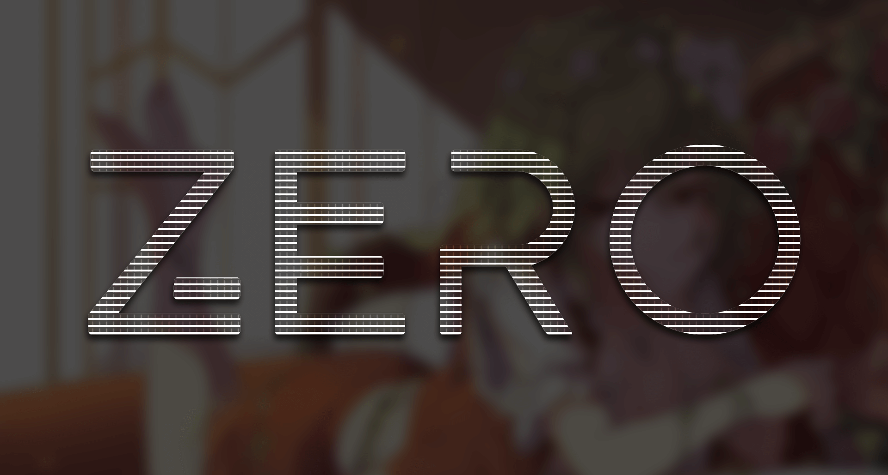

# ZERO：零
一款深灰色的主题，也是我的第一款主题


# 特性
>关于ZERO [https://www.bwxyz.top/posts/32/](https://www.bwxyz.top/posts/32/)
- 响应式 / 自适应设计
- Pjax 全站无刷新
- 图片懒加载
- 自带归档页面
- 自带友链解析
- 自带b站视频解析
- 后台高级设置功能
- 自认为很好看的博客（咳咳）

# 演示站点
[https://www.bwxyz.top](https://www.bwxyz.top)

# 使用
1. 下载**最新的 [Release](https://github.com/BlackWhite2000/Typecho-Theme-ZERO/releases)**
2. 解压后，**确认目录名为`ZERO`（全大写）**
3. 将文件夹放入Typecho根目录下的`usr/themes/`
4. 到后台启用主题
5. 更多自定义请在后台的 **`控制台/外观/设置外观`** 中设置

# 用前须知
- 关于代码高亮：代码高亮是用了 [CodePrettify](https://github.com/Xcnte/Code-Prettify-for-typecho) 插件，主题本身已内嵌，所以无需下载插件。
- 关于返回顶部：返回顶部是用了 [gotop](https://qqdie.com/archives/typecho-to-return-to-the-top-of-the-plug-in-i-first-ran-and-eggs.html) 插件，主题本身已内嵌，所以无需下载插件。
- 关于博客框架：框架采用了 [typecho-theme-dev-framework](https://github.com/AlanDecode/typecho-theme-dev-framework)。
- 建议导航栏页面总共不要超过5-6个，太多会挤，在未来我会考虑下级菜单的应用。
- 考虑到我一直是用笔记本搭建的，对于大屏幕可能没有适配好尺寸，如果遇到了请跟我说。

# 常见问题（请务必仔细阅读）
<details><summary>关于代码块</summary><br>
  
  使用代码块时候请按照以下格式来
  
```  
```语言
```
```

如

```
```css
```
```

</details>
<details><summary>添加归档页面</summary><br>
  新建独立页面，自定义模板选择<b>归档页面</b>内容留空。
</details>
<details><summary>添加友情链接</summary><br>
新建独立页面，然后这样写：

```
!!!
[links]
[BlackWhite]{一位设计师的博客，喜欢咕咕~ }[https://www.bwxyz.top/](https://img.bwxyz.top/img/logo/blog-favicon.png)
[BlackWhite]{一位设计师的博客，喜欢咕咕~ }[https://www.bwxyz.top/](https://img.bwxyz.top/img/logo/blog-favicon.png)
[/links]
!!!
```

>需要注意 [links]只能解析一次，而且这样写会触发随机排序功能。

```
!!!
{links}
[BlackWhite]{一位设计师的博客，喜欢咕咕~ }[https://www.bwxyz.top/](https://img.bwxyz.top/img/logo/blog-favicon.png)
[BlackWhite]{一位设计师的博客，喜欢咕咕~ }[https://www.bwxyz.top/](https://img.bwxyz.top/img/logo/blog-favicon.png)
{/links}
!!!
!!!
{links}
[BlackWhite]{一位设计师的博客，喜欢咕咕~ }[https://www.bwxyz.top/](https://img.bwxyz.top/img/logo/blog-favicon.png)
[BlackWhite]{一位设计师的博客，喜欢咕咕~ }[https://www.bwxyz.top/](https://img.bwxyz.top/img/logo/blog-favicon.png)
{/links}
!!!
```

>如果想多次解析请写{links}，但这样写不会触发随机排序功能。
具体效果可以查看我的博客友链[https://www.bwxyz.top/links.html](https://www.bwxyz.top/links.html)
</details>
<details><summary>添加bilibili视频</summary><br>
新建独立页面，然后这样写：

```
!!!
[bilibili]
[//player.bilibili.com/player.html?aid=50126219&cid=87746888&page=1]
[/bilibili]
!!!
```

链接获得方式直接在b站视频里面点击分享找到 **嵌入代码**，按照我提供的参考筛选链接。
比如

```
<iframe src="//player.bilibili.com/player.html?aid=50126219&cid=87746888&page=1" scrolling="no" border="0" frameborder="no" framespacing="0" allowfullscreen="true"> </iframe>
```

筛选成

```
//player.bilibili.com/player.html?aid=50126219&cid=87746888&page=1
```

效果参考 [https://www.bwxyz.top/posts/29](https://www.bwxyz.top/posts/29)
</details>

# 遇到问题
如果遇到使用上的问题，可以[留言](https://www.bwxyz.top/posts/32)，但当然不代表我完全都会，因为我也只是会点css的业余人士而已。<br>
如果你打算二次开发，请具备基本的css基础，同时对于二次开发我可能无法给你太多帮助，理由同上。

# 关于更新
因为工作学习关系，博客不会频繁更新，所以想二次开发的同学就不用担心更新问题啦（咳咳）<br>
关于未来的更新，如果只是小更新的话我不会选择发布，除非有什么特殊情况。

# 鸣谢
> 这些都是提供给我帮助，以及我参考学习的大佬们以及代码！

## 参考学习过的主题代码
- [VOID](https://github.com/AlanDecode/Typecho-Theme-VOID)（VOID）
- [Miracles](https://github.com/BigCoke233/miracles)（Miracles）
- [Violet](https://qqdie.com/archives/violet-typecho-themes.html)（Violet）

## 大佬们
- [AlanDecode](https://blog.imalan.cn/)（熊猫小A）
- [Eltrac](https://guhub.cn/)（Eltrac）
- [jrotty](https://qqdie.com/)（泽泽）
- [FGHRSH](https://www.fghrsh.net/)（FGHRSH）

# 支持我
>如果你想支持我，我当然会非常开心~
<div>支付宝微信</div>

# 版权
MIT &copy; [BlackWhite](https://github.com/BlackWhite2000)
请勿删除页脚版权信息哦~
